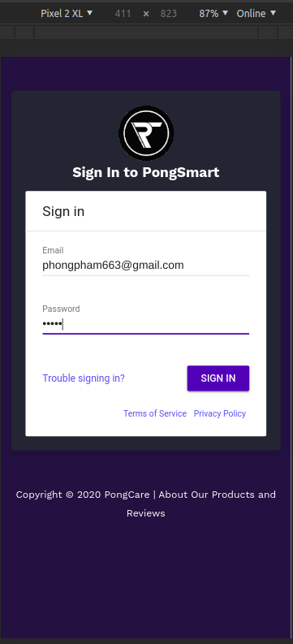
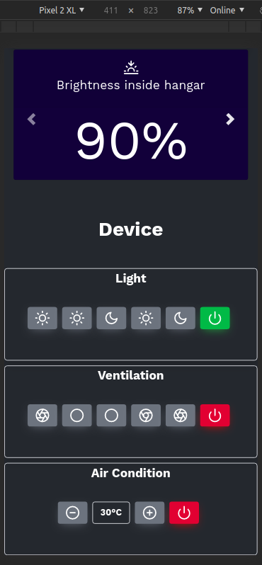
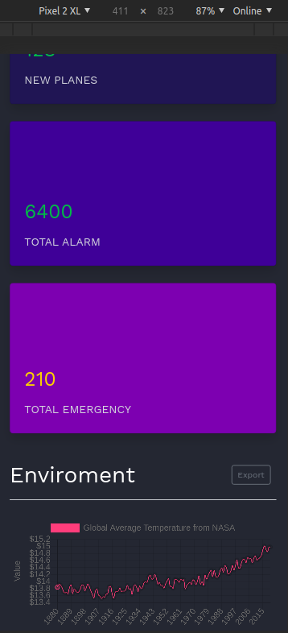

  

<h1 align="center" style="color: black;" >PongSmart IoT!</h1>
<h3 align="center">
  Internet Of Things controll & management smart devices via Web-App, Open-source Iot! 
</h3>

### About the project

The purpose of this project is to help manage IoT devices on the website application

  
  
  

### Perfomance wed-app 

  

### Feature
