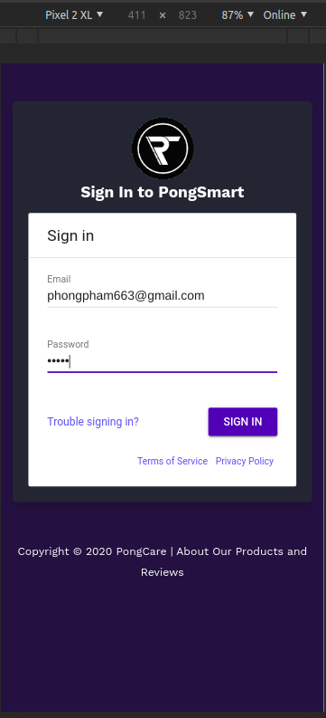
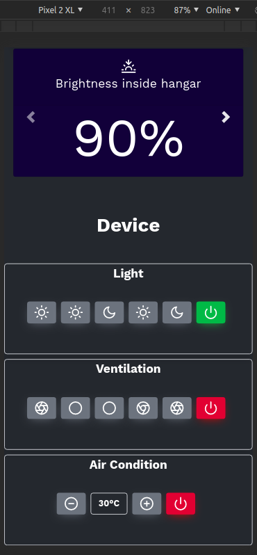
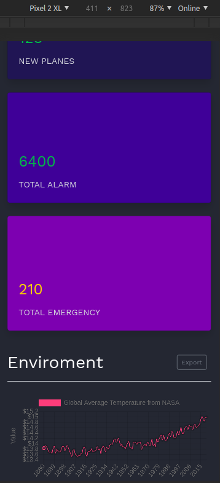
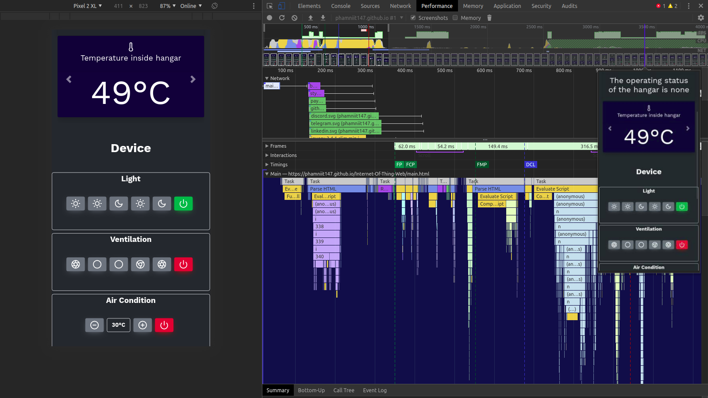

  

<h1 align="center" style="color: black;" >Ziship IoT!</h1>
<h3 align="center">
  Open source Web site providing solutions for Internet Of Things, News, Tutorial, Blog, etc.
</h3>

### About the project

The purpose of this project is to help manage IoT devices on the website application

  
  
  

### Perfomance wed-app 

  

### Feature
